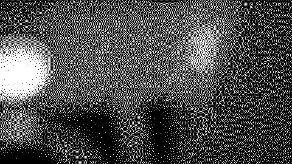

# just cycles

A druid script about cyclicality, life, and keeping track of cycles for jf+crow.

Impulse for writing this script came from the forum, when someone enquired for end-of-cycles pulses from jf. I hacked together a quick implementation, before this developed more conceptually. Thanks for that impulse. Earlier familiarity and some thoughts from Maths, which has end-of-cycle as well as end-of-rise outputs.

## requirements

crow, jf, i²c connection between crow and jf. interest in cyclicality.

## documentation

Crow outputs 1-4 give end-of-cycle pulses of jf outputs 1-4. Pulse width can be increased via positive voltage in crow input 1.

Additionally, jf 6 will trigger when at end-of-cycle of jf output 5. Jf outputs are not pulses like the crow outputs are, but usual jf shapes according to how curve, time, intone, advanced parameters via i2c etc.

Built primarily for jf *transient* and *sustain* modes. Start by patching triggers, gates or an LFO into jf trigger input 5 in *transient/shape* mode. Then patch crow outputs 1-4 to trigger things. Then mess with jf knobs, divide the jf with other trigger inputs, and use the jf output 6 as a related envelope for something.

crow polls jf at (currently at about 10 milliseconds). This gives constrains for how fast jf movements crow can detect. Stay below this pace for reliability. Exceed this pace if you feel like it.

# dedication

Dedicated to my feminist peers and mentors who insist on normalizing discussion of menstruation and alleviating "period stigma" across all cultures, including but not limited to those of trans folks. Our struggle continues (elsewhere).
